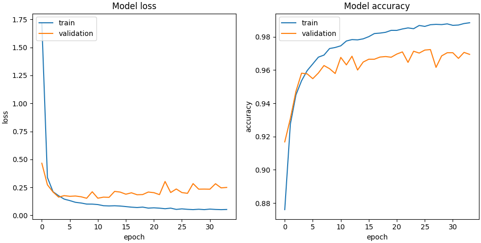
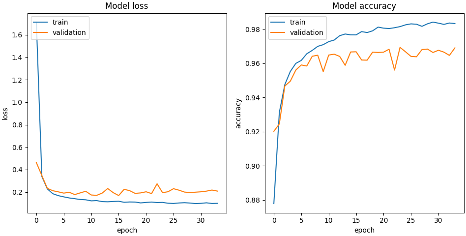

# Digit Recognizer

My first attempt on a machine learning project using neural networks. 

python-neural-network is a model based on the Kaggle Digit Recognizer project.

solution.py is a model trained from the MNIST dataset.

## Model

This model is a 3-layer NN, with 2 128-node hidden layers and a 10-node output layer with sparse categorical cross entropy as the loss function. Model was trained over 34 iterations.

I plotted the learning curve for this model with the MNIST validation set provided by Tensorflow Keras.

Metrics: (training accuracy, training loss, validation accuracy, validation loss) = (0.9890, 0.0532, 0.9694,  0.2495)

This suggested there has been some overfitting in my model so I added a regularization parameter with value 8e-5.

Metrics: (training accuracy, training loss, validation accuracy, validation loss = (0.9847, 0.0941, 0.9690, 0.2091)

Further steps could include trying a different architecture for the model, and since the training accuracy appears to still be increasing but the validation accuracy appears to have stagnated, there seems still be a problem of overfitting so collecting more data may be useful.

## Website

You can view this model in action on [https://xiaoning.vercel.app/digit-recognizer](https://xiaoning.vercel.app/digit-recognizer)

This model's performance isn't well high on that website. I have a few hypotheses for this:
* This model performs well on the validation set but it appears to not be so accurate on my website. Are there significant differences between the training data and the data captured from the HTML canvas? 
* Currently, the entire canvas is being used for the prediction: could cropping away the blank areas of the canvas so that the number drawn takes up the full frame improve predictions?
